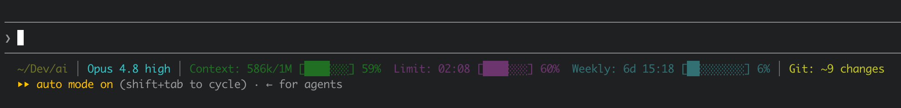

# Konfigurace Claude Code

Tohle je moje osobní konfigurace [Claude Code](https://docs.claude.com/en/docs/claude-code), kterou tu sdílím pro inspiraci. Třeba tu najdete něco užitečného i pro vaši práci. Budu rád i za jakékoliv vaše nápady a připomínky, napište mi na e-mail [jantichy@jantichy.cz](mailto:jantichy@jantichy.cz)!

Co bych z celého repozitáře vypíchl, aby to neuteklo vaší pozornosti?

## Instrukce

### [`CLAUDE.md`](CLAUDE.md) – hlavní soubor s instrukcemi

Na tomhle souboru je zajímavé hlavně to, že v něm skoro nic není 😉. Většina instrukcí je dekomponovaná do dalších .md souborů. Všimněte si, že mezi nimi rozlišuju ty, které obsahují kritické body společné pro všechny projekty a mají se použít vždy, a ty, které se načtou jen když je to podle situace potřeba. Brutálně se tím šetří kontextové okno.

### [`RULES.md`](RULES.md) – struktura a pořádek pod kontrolou

Obecná pravidla práce napříč všemi projekty: jak se mnou Claude komunikuje, jak organizuje soubory a obsah, jak rozhoduje a kde končí rozsah zadání, jak zachází se změnami. Je tu i celá osa životního cyklu práce – od `/project` až po `/release` – která říká, co je čí krok a co který krok naopak dělat nemá. A tabulka, podle které se vybírá model a effort pro každý typ úkolu: na návrhu a na ověřování nálezů se nešetří, mechanický sběr jede levně, a **levný model se vyplatí jen tam, kde se jeho chyba pozná levně**.

### [`skills/SKILLS.md`](skills/SKILLS.md) – norma, jak vypadá skill

Dlouho jsem tvar svých skillů nikde zapsaný neměl – vymyslel jsem ho jednou a pak ho patnáctkrát opsal, což z něj dělá zvyk, ne standard. Tohle je jeho sepsání a zároveň revize: co obstálo (vymezení proti **jmenovanému** sousedovi, ověřovatel, jehož úkolem je nález vyvrátit, dvě jednoznačné koncové věty), co byla jen setrvačnost (pre-flight opsaný v deseti skillech) a co chybělo (sekce s častými chybami, mez délky, progresivní odhalení do vedlejších souborů). Je tu i pravidlo, které mi dlouho unikalo, přestože jsem ho už dvakrát použil: **skládej, nepiš znovu** – než napíšeš krok, zjisti, jestli ho neumí vestavěný skill, plugin nebo hook, a jestli ho nejde jen obalit tak, aby se ta implementace dala později vyměnit beze změny volání.

### [`skills/PREFLIGHT.md`](skills/PREFLIGHT.md) – společný začátek běhu

Kořen projektu, worktree layout, co se čte z projektového `CLAUDE.md`, stav pracovního stromu, zelená linka a určení rozsahu z gitu. Dvanáct skillů to mělo každý svoje, což je nejhrubší porušení „single source of truth", jakého jsem se v téhle konfiguraci dopustil. Teď je to sepsané na jednom místě a skill si má psát jen svoje odchylky – **převedený je zatím jen `/skill` sám**, zbytek na převod čeká, až ho proženu `/skill update`.

## Skilly, jak jdou po sobě

Následující skilly tvoří jednu osu od založení projektu po nasazení. Nemusí se projít celá – u drobné změny odpadá zadání i plán, u projektu bez kódu i nasazení.

### [`/project`](skills/project/) – projekt nastavený na pár kliknutí

Postupně se zeptá na všechno, co se u nového projektu řeší pokaždé znovu – lidský název, git a remote, autocommit, typ projektu, kontrakt příkazů – a rovnou to nastaví včetně `README.md`, `.gitignore` a standardní struktury. Nový projekt zakládá režim **`create`**; umí ale i projekty, které už existují (**`adopt`**): udělá inventuru a dorovná je na moje dnešní preference, nikdy nepřepíše soubor bez zeptání. Zvládá i **worktree layout**, tedy kontejner s `.bare` a jedním podadresářem na větev.

Nad projektem, ve kterém pozná svůj vlastní otisk – blok metadat v `CLAUDE.md` –, se chová jinak: přepne se do režimu **`update`** a místo otázek projde celý projekt proti tomu, jak standardy vypadají dnes – sekce v `CLAUDE.md`, deklarace a kontrakty, umístění a vnitřní tvar dokumentace, odkazy na skilly a doménové znalosti, které se mezitím mohly přejmenovat. Řeší to jinak nepříjemnou vlastnost celé téhle vrstvy: konfigurace se vyvíjí dál, ale projekty založené za starého nastavení v něm zůstanou stát a samy o tom neřeknou. Tohle je způsob, jak je dorovnat jedním zavoláním. Projekt bez otisku – ať v něm skill nikdy neběžel, nebo ho nastavovala starší verze – jde nejdřív průvodcem (režim **`adopt`**) a dorovnání na něj přijde na konci.

### [`/specify`](skills/specify/) – z nápadu zadání, než se sáhne na kód

Vyptá se mě na záměr a udělá z něj **dva dokumenty**: `requirements.md` odpovídá na otázku co stavíme a proč, `architecture.md` na otázku jak. Hranici mezi nimi drží tvrdě, včetně testu, kam která věta patří: *změní se to, když vyměním databázi?* A dokud není zadání schválené, nesmí vzniknout ani řádek kódu, ani scaffold.

### [`/oponent`](skills/oponent/) – oponentura na to, co nejde otestovat

**Krok osy mezi zadáním a plánem** – protože jinak návrh neměří nikdo: `/review` ověřuje kód proti specifikaci, ale samotnou specifikaci nikdo proti ničemu, takže vada v ní projde celou osou jako korektní. Pošle na dokument agenty, kteří **nemají z naší session žádný kontext** a čtou jenom soubory; každý dostane jiný úhel z katalogu rozděleného na **metody** (jak se dívat) a **domény** (na co se dívat), protože metoda bez domény je slepá a doména bez metody sbírá povrch. Každý závažný nález pak dostane ověřovatele, jehož úkolem je nález **vyvrátit** – falešnou námitku tak zabije stroj, ne já. U drobné změny se přeskočí, u nového systému ne.

### [`/breakdown`](skills/breakdown/) a [`/implement`](skills/implement/) – plán a jeho odpracování

`/breakdown` vyrobí ze zadání `docs/plan.md` – seřazený seznam úkolů, kde každý má konkrétní soubory, kód testu a ověřitelné kritérium – a `/implement` ho odpracuje úkol po úkolu, každý do zelené linky a do commitu. Na pozadí obojí řídí [superpowers](https://github.com/obra/superpowers); moje obálky navíc vynucují cesty v `docs/`, odmítnou se spustit bez schváleného zadání a u rozdělaného plánu nevěří zaškrtávátkům, ale ověří si v kódu, že odškrtnuté úkoly opravdu existují.

### [`/review`](skills/review/) – panel nezávislých pohledů na hotovou práci

Prověří hotovou práci před uzavřením ze tří stran: nejdřív nástroje projektu (testy, lint, audit závislostí, scan tajemství, statická analýza), pak paralelní panel agentů, kde každý má jediný úhel pohledu – korektnost, bezpečnost, data a stavy, provoz, testy, agentní infrastruktura, moje doménové standardy – a nakonec ověřovatele, jehož úkolem je nález **vyvrátit**. Co ověření nepřežije, se mi vůbec nezobrazí. Výchozí rozsah jsou změny na větvi; **`/review full`** pustí týž panel nad celým projektem – hodí se u zděděného kódu nebo když se dlouho nedělalo, ale je to z celé soustavy nejdražší běh, takže se předem zeptá, kolik souborů projde.

### [`/consistency`](skills/consistency/) – ultimátní skill proti bordelu

Audit vnitřní konzistence: protichůdné instrukce, duplicity, zapomenuté zbytky po smazaných částech, mrtvý kód, drift mezi vrstvami. Nálezy roztřídí od kritických po kosmetické, jednoznačné opravy udělá rovnou a o sporných se mnou mluví jednu po druhé. Výchozí rozsah jsou soubory dotčené prací na větvi **a ti, kdo na ně odkazují** – nekonzistence skoro nikdy nežije v jednom souboru; **`/consistency full`** projde celý projekt bez ohledu na diff, což se vyplatí jednou za čas a před nasazením, ne po každé feature.

### [`/cleanup`](skills/cleanup/) – ať po mně zůstane čisto a jasno

Před opuštěním nebo zkompaktováním session projde celou konverzaci – včetně části, kterou už compact vyhodil z kontextu – a zapíše všechno dohodnuté tam, kam to patří, i s důvody a zavrženými variantami. Hned po vytěžení konverzace hledá druhou věc: co v ní zůstalo viset. Napíše mi dlouhou odpověď s návrhy a otázkami, já se chytím poloviny a od zbytku uteču – a nikdo si toho nevšimne. Tyhle zamluvené kusy dohledá, ověří, že se to nevyřešilo někde dál jinudy, a probere je se mnou jeden po druhém, dokud je ještě koho se ptát – tedy dřív, než začne zapisovat. Pak pošle na projekt agenta bez kontextu, který ověří, jestli z dokumentace jde na dnešní práci navázat, commitne a dá jednoznačný verdikt: je zapsáno, nebo tohle ještě zbývá. Co by jinak zůstalo „mimo rozsah úklidu“, mi předtím vypíše najednou a zeptá se, jestli to máme vyřešit hned, nebo zapsat do todo – aby se to neztratilo se zavřenou session. Stojím-li ve worktree větve, řekne navíc rovnou, že větev jde bez obav přimergovat do main – ale nemerguje ani nic nepřipravuje. **`/cleanup full`** nezvětšuje vytěžení session – to běží vždycky celé –, ale rozšiřuje závěrečnou kontrolu čerstvýma očima z dnešní práce na celou dokumentaci.

### [`/attack`](skills/attack/) – zkusit aplikaci rozbít

Zvedne aplikaci lokálně a pošle na ni agenty, kteří ji zkouší rozbít – každý s jedním vektorem: nesmyslné vstupy, přeskočené a zopakované kroky, cizí ID v adrese, mezní data, výpadek sítě uprostřed odesílání. Na rozdíl od `/review`, který kód čte, tenhle ho spouští. Každý nález musí mít reprodukční postup a každá oprava regresní test. Pouštím ho před nasazením, ne po každé feature, a útočí se výhradně na lokální instanci nad testovacími daty. Výchozí rozsah je to, čeho se dotkla práce na větvi; **`/attack full`** jde po celé aplikaci – u větší je rozumné se předem dohodnout, kolik času tomu dát.

### [`/release`](skills/release/) – nasazení jako vědomý úkon, ne vedlejší efekt

Nasadí do produkce přes **oddělenou nasazovací větev** `production`, takže `main` zůstane integrační a merge feature nic nenasazuje. Před nasazením hlídá čistý strom, zelenou linku, produkční build, audit závislostí a jestli proběhlo `/review` a `/attack`; zvlášť řeší **migrace** dopředu kompatibilně, aby rollback kódu neshodil aplikaci na datech nové verze. Nikdy se nespustí sám, nic neopravuje a po nasazení ověřuje na produkční URL. **A tím nekončí:** poslední fází je **sledovací okno** s konkrétním koncem, protože celá třída chyb se projeví až později – backfill migrace, cache, chyba, která nastane až na produkčním objemu dat. Dokud okno neuplyne a někdo ho výslovně neuzavře, nasazení není hotové.

## Skilly mimo osu

Tyhle se pouštějí podle potřeby, nezávisle na fázi projektu.

### [`/skill`](skills/skill/) – skilly, které se samy udržují

Zakládá nové skilly proti normě (`create`), vytěží skill z rozdělané konverzace (`extract`), **prožene existující skilly revizí** (`update`) a umí skill i zrušit (`delete`) včetně všech stop – README, osy, testů, odkazů z jiných skillů a sekcí v projektových `CLAUDE.md`. Revize je ten důvod, proč vznikl: norma se posouvá dál, ale patnáct souborů zůstane stát a samy o tom neřeknou. Klade přitom otázku, kterou nepoloží nikdo jiný – *nevzniklo mezitím něco, co tenhle skill dělá ručně?* – protože konfigurační vrstva roste pod nohama a starší skill o nových možnostech neví.

Sám je ukázkou vlastního pravidla *skládej, nepiš znovu*: tvar a napojení na okolí jsou moje, ale měření spolehlivosti vyvolání deleguje na Anthropicův `skill-creator` a tlakové scénáře na `superpowers:writing-skills`. Obojí je přiznané jako vyměnitelný vnitřek, ne jako rozhraní.

### [`/autocommit`](skills/autocommit/) – každá změna hned do Gitu

Zapne pro daný projekt režim, kdy Claude po každém logickém celku automaticky commituje, a pokud je nastavený remote, taky pushuje. Nehodí se do všech projektů, ale tam, kde mám hromadu rychlých iterací, mi to šetří desítky až stovky commit instrukcí za den.

### [`/replace`](skills/replace/) – přejmenovat něco a fakt všude

Přejmenuje pojem napříč projektem včetně **odvozených tvarů** a české skloňované varianty, kterou grep na základní tvar nenajde. Sahá i na názvy souborů a adresářů, přesouvá přes `git mv`, ať se neztratí historie, a hlídá pořadí – delší tvary před kratšími. Povinný poslední krok je kontrolní průchod na starý tvar, který musí vrátit nulu.

### [`/report`](skills/report/) – data do jednoho souboru, co jde poslat komukoliv

Z exportu z GA4, CSV nebo výsledku dotazu do BigQuery udělá jeden interaktivní HTML soubor, který jde otevřít dvojklikem odkudkoliv: žádné CDN, aby fungoval offline i za pět let, `charset=utf-8` hned na začátku a datum vygenerování zapsané natvrdo. Než ho pustí ven, projde hotový soubor na osobní údaje a na přístupové údaje, které do reportu proteču samy z výpočetního skriptu nebo ze screenshotu administrace.

### [`/compose`](skills/compose/) – texty, co znějí jako já

Napíše článek, post na sociální sítě nebo vlákno mým hlasem a stylem – ne obecnou AI-češtinou. Táhne to ze znalostní báze mého psaní a k tématu si dohledá nejpodobnější texty z archivu jako živé vzory. Moje názory a pointy si ale nikdy nevymýšlí, ty musím dodat sám.

### [`/invoicing`](skills/invoicing/) – faktury na konci měsíce bez ručního sčítání

Konec měsíce znamenal pokaždé totéž: projít timetracking, sečíst hodiny po projektech, přepsat je do fakturačního systému, stáhnout dvě PDF a napsat ke každému mail. Tenhle skill to udělá za mě a u každého klienta se zastaví dřív, než něco vystaví – ukáže mi, co napočítal, co vyřadil a co je mu podezřelé. **Hranici „odkud počítat“ nikdy neodhaduje**: čte ji z poslední faktury, takže se to nerozejde ani při faktuře vystavené ručně. Končí rozepsaným draftem s fakturou a výkazem hodin v příloze a **odeslat ho musím vždycky já** – tvrdá stopka, která platí i tehdy, když ho o odeslání sám uprostřed běhu poprosím. Sazby, daňový režim a dohody s klienty **v tomhle repozitáři nejsou**; skill je rámec a konkrétní čísla si tahá ze soukromé knowledge base.

### [`/transcript`](skills/transcript/) – nahrávky na přepis a chytré shrnutí

Ze zvukových nahrávek udělá pořádek: každou přepíše do Markdownu, napíše jedno strukturované shrnutí se soupisem domluv a úkolů na konci, nebo obojí – podle toho, co si vyberu. Přepis běží **lokálně a offline** přes [whisper.cpp](https://github.com/ggml-org/whisper.cpp), takže nahrávka neopustí můj počítač. Než začne, zeptá se na pár věcí a podstrčí rozpoznávači jména a názvy, které v nahrávce padnou – ta pak nekomolí lidi ani firmy. Text uhladí: vyhází „ehm“, odstraní halucinace rozpoznávače, opraví přeslechy a rozseká to do kapitol. Jazyk pozná sám a na vyžádání rozliší i mluvčí, takže úkoly ve shrnutí mají majitele.

## Hooky, skripty a nastavení

### [`statusline.sh`](statusline.sh) – krásná a užitečná status line

Jednořádková status line, která mi ukazuje všechno, co potřebuju průběžně vidět: aktuální model, zaplnění kontextového okna, čerpání 5hodinového i týdenního limitu, aktuální adresář i stav Gitu. Čerpání vizualizuje teploměrem, procenty i zbývajícím časem a mění barvy podle toho, jak je na tom blízko limitu.

### [`iterm-notify.sh`](iterm-notify.sh) – záložka, která si řekne o pozornost

Když Claude doběhne nebo se na něco ptá, obarví se záložka iTermu do modra, a jakmile na ni přepnu, barva sama zmizí. Je-li záložka aktivní už ve chvíli, kdy Claude doskončí, neobarví se vůbec. Napojené na tři hooky: `UserPromptSubmit` barvu maže, `Notification` a `Stop` ji rozsvítí. Funguje jen v iTerm2.

### [`green-line.sh`](green-line.sh) – nad rozbitým projektem se práce neuzavře

`Stop` hook, který před ukončením tahu spustí typecheck, lint a testy, a když něco padá, **nepustí Clauda skončit** – dostane zpátky výstup a musí to dořešit. O projektu nic neví: přečte si sekci `## Příkazy` v jeho `CLAUDE.md` a spustí, co tam stojí, takže je registrovaný jednou globálně a v projektu bez kontraktu neudělá nic. A protože je ten kontrakt kód ležící v repozitáři, nespustí v něm nic, dokud pro něj nevydám souhlas (`--allow`) – ten platí pro **celý repozitář včetně jeho worktree**, takže nová větev si o něj neříká znovu. Rozlišuje přitom dvě různé věci: **test, který našel chybu**, tah zablokuje, kdežto **krok, který vůbec nejde spustit**, jen ohlásí – tam není co opravovat na kódu, ale na prostředí.

### [`tests/`](tests/) – testy nad konfigurací, ne nad kódem

Skilly a pravidla jsou text, který nikdo nespouští, takže se jejich vady projeví až za běhu a obvykle tiše: režim popsaný v těle skillu, který chybí v jeho hlavičce, odkaz na soubor nebo na sekci, co mezitím zmizela, nebo skill, který v README chybí. Druhá sada testuje **zelenou linku** – jediné místo v celé konfiguraci, které něco doopravdy vynucuje, a tedy to, kde tichá regrese stojí nejvíc: osmnáct scénářů nad dočasným repozitářem, od souhlasu přes rozdíl mezi „test našel chybu“ a „test nejde spustit“ až po zámek proti souběhu dvou session. Obojí stojí nula tokenů a běží v zelené lince po každém tahu. Od zavedení normy tvaru skillu k nim přibyla **ráčna**: množina skillů, které normu nesplňují, se musí *rovnat* seznamu výjimek, takže opravený skill, který se ze seznamu nevyškrtne, shodí testy stejně jako regrese – jinak by výjimka tiše přežila dokončenou migraci a přestala cokoliv měřit. Napsal jsem je až po roce používání a **první běh hned našel tři vady**, které mi při ručním čtení třikrát utekly; testy zelené linky pak hned napoprvé odhalily, že souhlas nesedí na cestu vedoucí přes symlink. Jen standardní knihovna Pythonu, žádná instalace.

### [`settings.json`](settings.json) – průběžně laděné permissions

Allowlist/denylist/asklist se snažím držet ve vyváženém poměru „bezpečnost vs. flow“. Cíl je nemuset odklikávat každou trivialitu, ale zároveň nenechat bez kontroly moc bezpečnostních děr. Tohle je vždycky lavírování na hraně a občas tu jdu vědomě lehce za hranu – ve prospěch svého pohodlí a na úkor středně rizikových operací. Takže si to k sobě rozhodně nekopírujte bezhlavě, ale můžete to vzít čistě inspiračně pro porovnání s vlastním nastavením.

## Než si odsud něco vezmete

Tohle je obsah mého `~/.claude`, ne balíček k instalaci. Když si budete něco kopírovat, počítejte s pár věcmi:

- **Absolutní cesty.** `settings.json` i skilly mají natvrdo `/Users/honza/…` – v hoocích, ve statusline, v permissions. Přepište je na své, jinak vám budou tiše selhávat.
- **Předpoklady.** Plugin [superpowers](https://github.com/obra/superpowers), na kterém stojí `/specify`, `/breakdown` a `/implement`. Dál macOS s [Homebrew](https://brew.sh), `jq`, `coreutils` kvůli `gtimeout` a iTerm2 kvůli barvení záložky. **`shellcheck` je tady povinný** – je to jediný `lint` v kontraktu tohohle repozitáře, takže bez něj hlásí zelená linka po každém tahu nespustitelný krok. Volitelné jsou `gitleaks` a `semgrep`: bez prvního sáhne `/review` po slabší grep-heuristice, bez druhého příslušná kontrola odpadne – a skill to v obou případech napíše do výpisu *Nezkontrolováno*. **`/transcript` má vlastní sadu navíc:** `ffmpeg`, `whisper-cpp` a stažené modely, u rozlišení mluvčích k tomu `pyannote.audio` ve vlastním venv, účet a token na HuggingFace a **ruční odsouhlasení licencí tří gated repozitářů v prohlížeči** – to je jediný předpoklad v celém repozitáři, který nejde zautomatizovat. Velikosti a přesné příkazy drží [jeho `SKILL.md`](skills/transcript/SKILL.md); skill si na chybějící kusy posvítí sám.
- **Část znalostí v repu není.** Skilly se opírají o soukromý adresář `~/Dev/context/` s doménovými standardy (`coding/`, `web/`, `analytics/`, `text/`, `design/`, `training/`, `structure/` a další) a odkazují do něj. To je moje soukromé know-how a osobní archiv, takže ho tu nenajdete – ty skilly jsou k mání jako kostra, ne jako hotová věc.
- **Berte to po částech.** `RULES.md` funguje samostatně a použitelný je nejspíš hned. Skilly si projděte a upravte. `settings.json` si rozhodně proberte řádek po řádku – kromě permissions v něm jsou i hooky, statusline, pluginy a osobní nastavení modelu a jazyka.
- **Licence.** Všechno tady je pod [MIT](LICENSE) – berte si, co chcete, jen si to nechte na vlastní triko.
